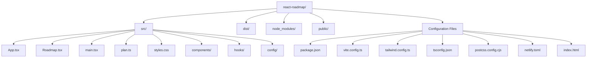
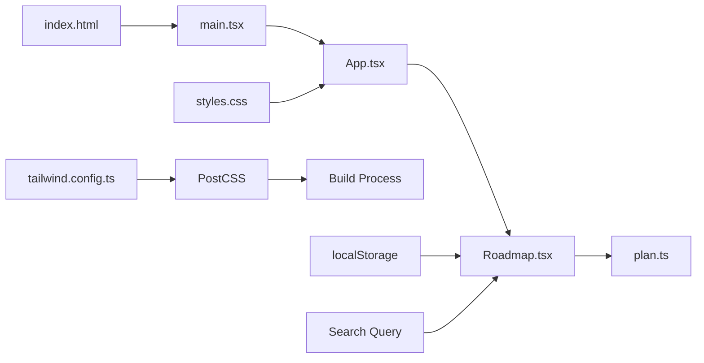
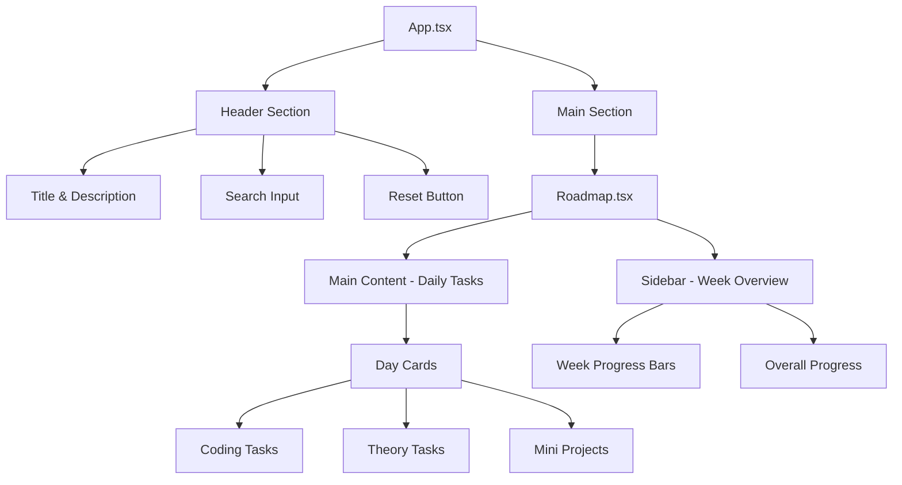
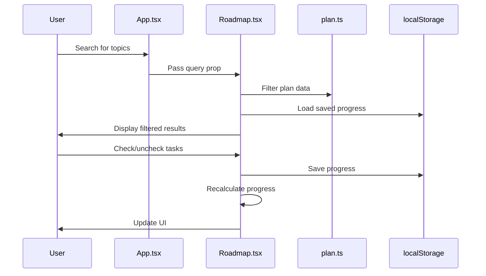
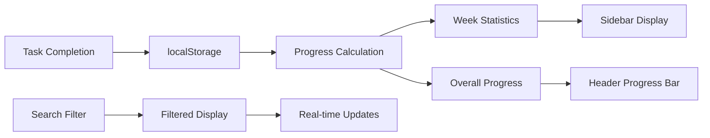

# React Roadmap Tracker

A comprehensive 30-day interview preparation roadmap application built with React, TypeScript, and Tailwind CSS. This application helps developers track their progress through JavaScript, React, Vue, and Node.js learning materials.

## 📁 Project Structure Analysis

### Directory Structure



### File Architecture Flow



## 📊 Project Configuration Analysis

### Package Dependencies

| Category | Package | Version | Purpose |
|----------|---------|---------|---------|
| **Core** | react | ^18.2.0 | React library |
| **Core** | react-dom | ^18.2.0 | React DOM rendering |
| **UI** | lucide-react | ^0.468.0 | Icon library |
| **Dev** | @types/react | ^18.2.0 | TypeScript types for React |
| **Dev** | @types/react-dom | ^18.2.0 | TypeScript types for React DOM |
| **Dev** | @vitejs/plugin-react | ^5.0.1 | Vite React plugin |
| **Dev** | typescript | ^5.5.4 | TypeScript compiler |
| **Dev** | vite | ^5.4.1 | Build tool and dev server |
| **Styling** | tailwindcss | ^3.4.10 | Utility-first CSS framework |
| **Styling** | autoprefixer | ^10.4.20 | CSS vendor prefixing |
| **Styling** | postcss | ^8.4.45 | CSS processing tool |

### Build Configuration

| File | Purpose | Key Features |
|------|---------|--------------|
| `vite.config.ts` | Vite build configuration | React plugin, development server |
| `tailwind.config.ts` | Tailwind CSS configuration | Custom colors, shadows, border radius |
| `tsconfig.json` | TypeScript configuration | Strict mode, React JSX support |
| `postcss.config.cjs` | PostCSS configuration | Autoprefixer plugin |
| `netlify.toml` | Netlify deployment config | Build settings for deployment |

## 🏗️ Application Architecture

### Component Hierarchy



### Data Flow Architecture



## 📋 Learning Roadmap Structure

### Week Overview

| Week | Focus Area | Days | Key Topics |
|------|------------|------|------------|
| **Week 1** | JavaScript Fundamentals | 7 days | Variables, Functions, Classes, Promises, Event Loop |
| **Week 2** | Frontend Frameworks | 7 days | React, Vue, Routing, State Management |
| **Week 3** | Backend Development | 7 days | Node.js, Express, REST APIs, MongoDB |
| **Week 4** | Advanced Topics | 7 days | Testing, Performance, Security, Deployment |

### Daily Task Structure

Each day contains three types of tasks:

| Task Type | Description | Examples |
|-----------|-------------|----------|
| **Coding** | Hands-on programming exercises | Reverse string, Fibonacci sequence, API calls |
| **Theory** | Conceptual understanding questions | "What is closure?", "Explain event loop" |
| **Mini** | Small project implementations | Todo app, Weather app, Counter with closure |

### Progress Tracking System



## 🎨 UI/UX Design System

### Color Scheme

| Color | Hex Code | Usage |
|-------|----------|-------|
| Primary | #8ea0ff | Links, highlights, primary actions |
| Accent | #35d186 | Success states, progress indicators |
| Background | slate-950/80 | Main background with gradient |
| Text | slate-50 | Primary text color |
| Border | slate-700/40 | Subtle borders and dividers |

### Component Styling

| Component | Styling Approach | Features |
|-----------|------------------|----------|
| Header | Sticky positioning, backdrop blur | Search functionality, reset button |
| Sidebar | Sticky positioning, scrollable | Week navigation, progress overview |
| Day Cards | Grid layout, hover effects | Task checkboxes, progress indicators |
| Progress Bars | Gradient backgrounds | Visual progress representation |

## 🔧 Development Setup

### Prerequisites
- Node.js (v16 or higher)
- npm or yarn package manager

### Installation Steps
```bash
# Clone the repository
git clone <repository-url>
cd react-roadmap

# Install dependencies
npm install

# Start development server
npm run dev

# Build for production
npm run build

# Preview production build
npm run preview
```

### Available Scripts

| Script | Command | Purpose |
|--------|---------|---------|
| `dev` | `vite` | Start development server |
| `build` | `tsc -b && vite build` | TypeScript compilation + production build |
| `preview` | `vite preview` | Preview production build locally |

## 🚀 Deployment

The project is configured for deployment on Netlify with the following settings:

- **Build command**: `npm run build`
- **Publish directory**: `dist`
- **Node version**: Latest LTS

## 📈 Features Overview

### Core Features
- ✅ **30-day structured learning plan**
- ✅ **Progress tracking with localStorage persistence**
- ✅ **Real-time search functionality**
- ✅ **Week-by-week progress overview**
- ✅ **Responsive design for all devices**
- ✅ **Dark theme with modern UI**

### Technical Features
- ✅ **TypeScript for type safety**
- ✅ **React 18 with modern hooks**
- ✅ **Tailwind CSS for styling**
- ✅ **Vite for fast development**
- ✅ **Local storage for data persistence**
- ✅ **Responsive grid layout**

## 🔍 Code Quality & Best Practices

### TypeScript Implementation
- Strict type checking enabled
- Proper interface definitions for data structures
- Type-safe component props

### React Patterns
- Functional components with hooks
- Custom hooks for state management
- Memoization for performance optimization
- Proper prop drilling and state lifting

### Performance Optimizations
- React.memo for component memoization
- useMemo for expensive calculations
- Efficient filtering and search algorithms
- Optimized re-renders with proper dependencies

## 📝 Future Enhancements

### Potential Improvements
- [ ] Add user authentication
- [ ] Implement cloud sync for progress
- [ ] Add more interactive exercises
- [ ] Include video tutorials integration
- [ ] Add community features
- [ ] Implement spaced repetition algorithm
- [ ] Add export/import functionality
- [ ] Include more framework options

### Technical Debt
- [ ] Add comprehensive unit tests
- [ ] Implement error boundaries
- [ ] Add accessibility improvements
- [ ] Optimize bundle size
- [ ] Add PWA capabilities

---

**Built with ❤️ using React, TypeScript, and Tailwind CSS**
